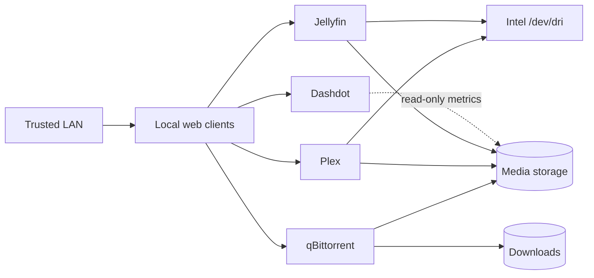

# ThinkVault Homelab

A small Docker Compose media stack built around Plex, Jellyfin, qBittorrent
with VueTorrent, and Dashdot. The repository contains only reproducible
deployment definitions; application databases, credentials, torrent state and
media are deliberately excluded.

## Architecture



## Services

| Service | Purpose | Default access |
| --- | --- | --- |
| Plex | Media streaming with Intel acceleration | Host network; port `32400` |
| Jellyfin | Open-source media streaming | `127.0.0.1:8096` |
| qBittorrent | Downloads + VueTorrent | Web `127.0.0.1:8080`; peer `*:6881` |
| Dashdot | Lightweight host/storage dashboard | `127.0.0.1:61208` |

`BIND_ADDRESS` controls Jellyfin, the qBittorrent Web UI and Dashdot; those
interfaces bind to loopback by default. Plex uses host networking instead, and
the qBittorrent peer port `6881/TCP+UDP` listens on all host interfaces. Review
the firewall rules before exposing either service beyond a trusted LAN.

## Requirements

- Linux host with Docker Engine and the Docker Compose plugin
- Intel graphics exposed at `/dev/dri` for Plex and Jellyfin transcoding
- Persistent storage for application state, media and downloads
- A firewall protecting every administrative interface

## Quick start

1. Clone the repository and create the local environment file:

   ```bash
   cp .env.example .env
   ```

2. Set the UID, GID, timezone and storage paths in `.env`:

   ```dotenv
   PUID=1000
   PGID=1000
   TZ=Etc/UTC
   CONFIG_ROOT=/opt/media-stack
   MEDIA_ROOT=/data/media
   DOWNLOADS_ROOT=/data/downloads
   HOST_STORAGE_ROOT=/data
   BIND_ADDRESS=127.0.0.1
   ```

3. Load the environment and create the required directories:

   ```bash
   set -a
   . ./.env
   set +a

   sudo install -d -o "${PUID}" -g "${PGID}" \
     "${CONFIG_ROOT}" \
     "${HOST_STORAGE_ROOT}" \
     "${MEDIA_ROOT}" \
     "${DOWNLOADS_ROOT}" \
     "${CONFIG_ROOT}/plex/config" \
     "${CONFIG_ROOT}/jellyfin/config" \
     "${CONFIG_ROOT}/jellyfin/cache" \
     "${CONFIG_ROOT}/qbittorrent/config" \
     "${MEDIA_ROOT}/films" \
     "${MEDIA_ROOT}/series" \
     "${MEDIA_ROOT}/animes" \
     "${MEDIA_ROOT}/films_anim"
   ```

   The privileged `install` command is required for the default `/opt` and
   `/data` paths. It assigns every directory to the UID and GID used by the
   LinuxServer containers. Paths below your home directory can be created
   without `sudo`.

4. Validate and start the stack:

   ```bash
   docker compose --env-file .env config --quiet
   docker compose --env-file .env up -d
   docker compose ps
   ```

## Storage layout

```text
/opt/media-stack/
├── plex/config/          # excluded runtime state
├── jellyfin/config/      # excluded runtime state
├── jellyfin/cache/       # excluded cache
└── qbittorrent/config/   # excluded runtime state

/data/
├── downloads/            # excluded download state
└── media/
    ├── films/
    ├── series/
    ├── animes/
    └── films_anim/
```

The paths are examples and can be replaced through `.env` without editing `compose.yaml`.

## Operations

```bash
# Pull newer images and recreate changed services
docker compose pull
docker compose up -d --remove-orphans

# Inspect service state and recent logs
docker compose ps
docker compose logs --tail 100

# Stop the stack without deleting persistent state
docker compose down
```

Because the source deployment uses floating image tags, review upstream
release notes and keep backups of application state before upgrades.

## Security and privacy

The source host contains runtime configuration with application tokens,
data-protection keys, cookies, certificates, media metadata, watch history and
torrent state. None of those files belong in Git.

See [SECURITY.md](SECURITY.md) before changing bind addresses, enabling router
port forwarding or adding configuration files.

## License

[MIT](LICENSE)
